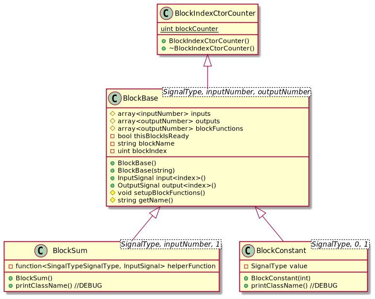
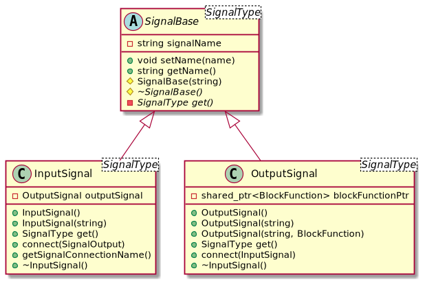

# Block Diagram Builder

This project is an attempt of creating a Block Diagram Builder to learn more about "Modern" C++ (revisions 11, 14, 17, 20... - I'm still in debt with 20's revision)

Here we have 2 main classes: `BlockBase` and `SignalBase`

A Block is fundamentally made of input **Signals** (0 or more), output **Signals** (0 or more) and *one* function for each output.

The Block hierarchy:

A Signal is what brings the Block diagram to life. When a `OutputSignal` is evaluated, it triggers recurrently (by design) the evaluation of every signal directly and indirectly connected to it.

The Signal hierarchy:

## The `main.cpp` example

In the `main.cpp`, we have a working example. If you want to see what happens with a recursion, just uncomment the indicated comment block, compile and execute it. On the figure bellow, the dashed lines represent the commented part of `main.cpp`

##TODO

* Handle closed loop diagrams
    * Currently, a diagram with a closed loop incurs in an infinity loop
        * Ideia 1: Create a BlockBuffer to cut the flow by having a state (of type `OutputSignalType`) that gives to the "point of close loop" a value to start with.
          * **This solution still allow the user to create a infinite-unsolvable loop**... Here we would need a health-checker thing to analise the infinity loop presence and raise a good error message about it (perhaps pointing out where is the problem)
        * Ideia 2: A flag in each Block that shows if it already was used/evaluated of not
            * This solution wouldn't need (**my guess**) a health-checker about the infinite loop. And seems to be a very simple implementation to solve this problem (**my guess**). Other advantage is to use this to avoid the re-evaluation of an already known output of a block.
* Already said, but it is important: evaluate each function block only one time for each loop evaluation.
* Something should call the diagram evaluation in a sense of event and/or time triggering 
* After handling a Closed Loop, assure that it runs as expected.
    * Something like a workspace to manage all this would be useful?
* How to fully evaluate a diagram that has more than one dead-end paths?
    * Again, the workspace thing seems handy.
